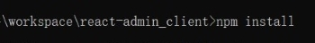

# Deployment instructions

## Recommended deployment process
[Back-end](#Back-end) -> [Database](#Database) -> [Front-end](#Front-end)

## Front-end
1. Open the command line and display it to the react-admin_client directory through the cd command.

## Back-end

## Database